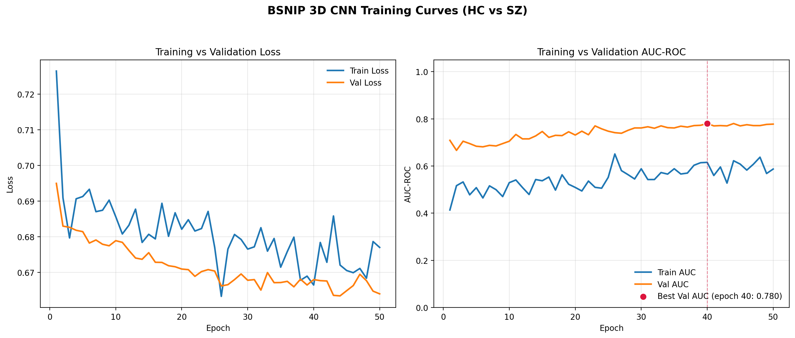
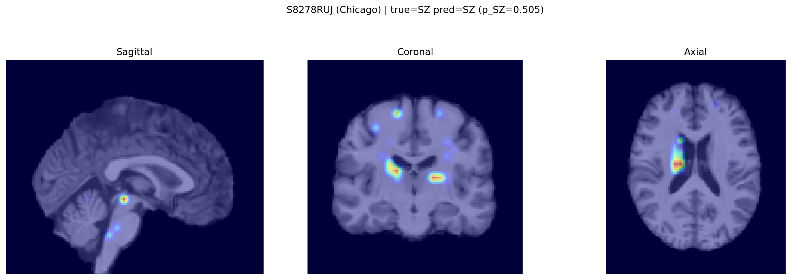
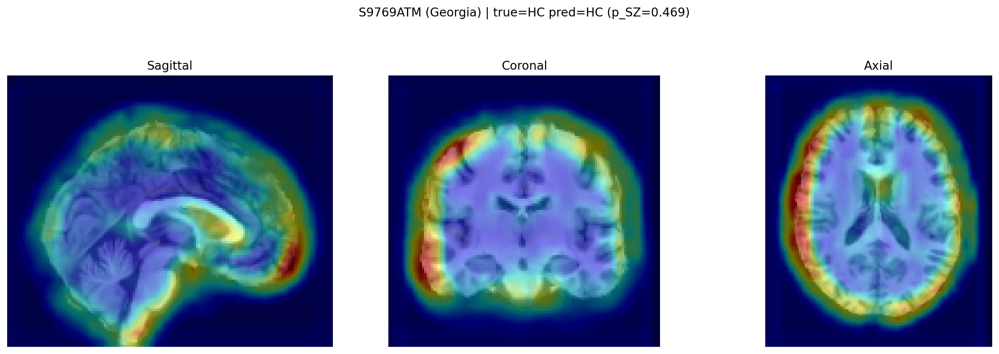
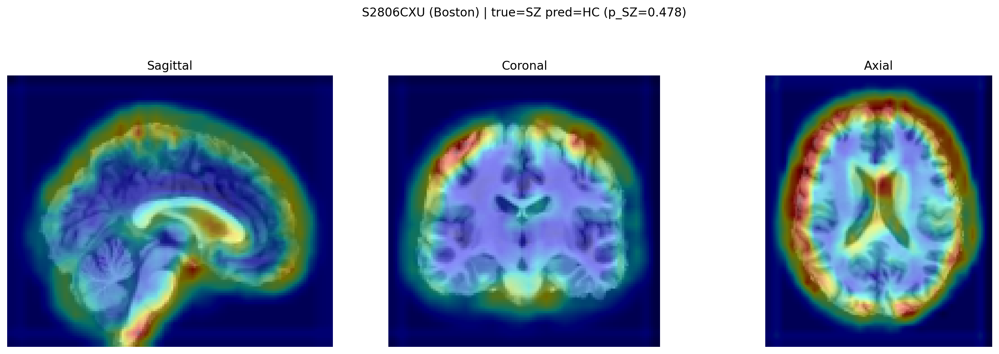
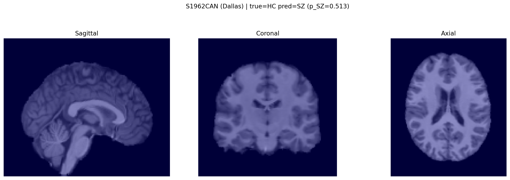

# B-SNIP 3D MRI Classification: Schizophrenia vs Healthy Controls

Automated 3D Deep Learning pipeline for binary classification of Schizophrenia (SZ) versus Healthy Controls (HC) using structural T1-weighted MRI scans from the B-SNIP consortium dataset.

---

## 1. Technical Framework, Algorithmic Decisions & Training Dynamics

### Preprocessing & Input Representation
* **Spatial Normalization & Matrix Shape:** Raw T1w MRI scans are skull-stripped, affinely aligned to MNI152 template space, and stored as dense volumetric tensors of shape $(C, D, H, W) = (1, 121, 145, 121)$.
* **Voxel Intensity Normalization:** Volumes are scaled purely via min-max normalization (`preprocessing.py`):
  $$x_{\text{norm}} = \frac{x - \min(x)}{\max(x) - \min(x) + 10^{-8}}$$
  bounding voxel intensities in the interval $[0, 1]$ without arbitrary distribution reshaping.

---

### Algorithmic Decisions & Architectural Evolution

#### 1. Transition from Dense Flattening to Global Average Pooling (GAP)
* **The Flattening Bottleneck (v1–v4):** In early iterations (`BSNIP3DCNN` with `--no-use-gap`), the 3-block convolutional backbone output $\mathbf{X} \in \mathbb{R}^{32 \times 15 \times 18 \times 15}$ (where $32$ is `conv3` output channels) was flattened into a vector of length $32 \times 15 \times 18 \times 15 = 129,600$. 
  * *Failure Mode:* The first fully connected layer $\mathbf{W}_{\text{fc1}} \in \mathbb{R}^{128 \times 129600}$ contained over $16.59$ million trainable parameters. On a training split of $N_{\text{train}} = 261$, this capacity led to early overfitting by Epoch 3, with logits collapsing into a tight, poorly calibrated band around $p \approx 0.505$.
* **The Global Average Pooling Formulation (`v5`):** Activated via `--use-gap`, replacing vectorization with `nn.AdaptiveAvgPool3d((1, 1, 1))`. For each of the $C=32$ feature maps:
  $$\mu_k = \frac{1}{D \times H \times W} \sum_{d=1}^D \sum_{h=1}^H \sum_{w=1}^W X_{k}(d, h, w)$$
  * *Justification:* Collapses the spatial volume into a 32-dimensional descriptor. The classification head retains its two-layer structure (`Linear(32, 128)` followed by `Linear(128, 2)`), reducing head parameters to $32 \times 128 + 128 + 128 \times 2 + 2 = 4,482$ weights. This forces convolutional filters to extract translation-invariant semantic features across the entire cranial volume rather than memorizing slice-coordinate cues.

#### 2. Loss Function & Class Weighting
* **Unweighted Cross-Entropy:** In `v4`, inverse-frequency weighting was applied with a lower learning rate ($2\times 10^{-5}$), causing vanishing gradients and collapsing sensitivity to zero.
* **Selection for `v5`:** With class distributions in train ($149$ HC vs $112$ SZ) being mildly balanced, standard unweighted Cross-Entropy was restored (`--no-weighted-loss`), enabling healthy gradient flow across both classes:
  $$\mathcal{L}_{\text{CE}} = - \sum_{i=1}^B \log\left(\frac{e^{z_{y_i}}}{\sum_{j=1}^2 e^{z_j}}\right)$$

#### 3. Optimizer & Hyperparameters
* **Adam Optimizer:** Configured with `torch.optim.Adam(model.parameters(), lr=1e-4, weight_decay=1e-4)`. The learning rate of $1\times 10^{-4}$ provides sufficient gradient momentum for Adam moments to escape initial plateaus in the smoothed GAP loss landscape.
* **Batch Size ($B = 4$):** Maximizes volumetric GPU throughput within 32GB VRAM limits while providing mini-batch stochasticity.

#### 4. Real-Time 3D Data Augmentation Pipeline
* Configured in `bsnip_dataset.py` for the training split only (`is_train=True`):
  * **Random 3D Translations:** Shifts up to $\pm 2$ voxels (`AUGMENT_MAX_SHIFT_VOXELS = 2`) independently along depth, height, and width.
  * **Random Sagittal Flips:** Left-right mirroring along the sagittal plane with probability $p=0.5$.
  * **Additive Gaussian Noise:** $\mathcal{N}(0, \sigma^2)$ with $\sigma=0.02$ (`AUGMENT_NOISE_SIGMA = 0.02`) added to voxel intensities.
  * **Validation/Test Splits:** Kept strictly deterministic (zero augmentation).

#### 5. Validation-Tuned Threshold Grid Search
* To prevent test set leakage, `train_3dcnn.py` conducts a grid search over $p \in [0.10, 0.90]$ with step size $0.01$ (`np.arange(0.1, 0.91, 0.01)`) on validation probabilities to maximize Balanced Accuracy:
  $$p^* = \arg\max_{p} \left( \frac{\text{Sensitivity}(p) + \text{Specificity}(p)}{2} \right)_{\text{Val}}$$
* In `v5`, the optimal validation threshold converged naturally to **$p^* = 0.500$** ($71.25\%$ Val Balanced Acc), confirming native logit calibration.

---

### Training Dynamics & Quantitative Results

<p align="center">
  
</p>

* **Continuous Learning:** Monotonic decrease in Validation Loss alongside Training Loss across 50 epochs ($\approx 0.73 \to 0.66$).
* **Validation Peak:** Best checkpoint achieved at **Epoch 40** with **Val AUC-ROC = 0.7800** (saved to `runs/bsnip_3dcnn_v5/best_model.pth`).
* **Test Performance (Unseen $N=57$ subjects):**

| Metric | Healthy Controls (HC) | Schizophrenia (SZ) | Macro Summary |
| :--- | :--- | :--- | :--- |
| **Precision** | **0.81** (81%) | 0.54 (54%) | **0.6745** (Macro Avg) |
| **Recall (Sensitivity)** | 0.41 (41%) | **0.88** (88%) | **0.6431** (Macro Avg) |
| **F1-Score** | 0.54 | **0.67** | **0.6042** (Macro Avg) |
| **Balanced Accuracy** | — | — | **64.31%** |
| **Overall Accuracy** | — | — | **61.40%** |
| **Optimal Threshold** | — | — | **$p^* = 0.500$** |

---

## 2. Clinical Interpretation, Explainability & Neuroanatomical Biomarkers

### 3D Grad-CAM Explainability & Structural Verification
3D Grad-CAM computes activation gradients with respect to the final convolutional feature maps (`conv3`):
$$A_{\text{Grad-CAM}}^c = \text{ReLU}\left( \sum_{k=1}^{32} \alpha_k^c A^k \right), \quad \alpha_k^c = \frac{1}{D \cdot H \cdot W} \sum_{d,h,w} \frac{\partial y^c}{\partial A^k(d,h,w)}$$

#### Correct Classifications (True Positives vs True Negatives)

<b>True Positive (SZ, p=0.505)</b> — Focal activation on the left lateral ventricle anterior horn and striatal boundary.

<b>True Negative (HC, p=0.469)</b> — Diffuse cortical mantle activation with preserved ventricular margins.

#### Classification Errors (False Negatives vs False Positives)

<b>False Negative (SZ misclassified as HC, p=0.478)</b> — Atypical SZ scan with normal ventricular volume driving cortical prediction.

<b>False Positive (HC misclassified as SZ, p=0.513)</b> — Borderline uncertainty showing flat, low-magnitude gradients.

---

### Neuroanatomical Findings & Alignment with B-SNIP Literature
* **Lateral Ventriculomegaly:** In correctly identified Schizophrenia subjects (`S8278RUJ`), gradients focus on the **anterior horns of the lateral ventricles** and central CSF interfaces, capturing central ventriculomegaly—the hallmark macroscopic structural deviation of schizophrenia.
* **Cortical Mantle Integrity:** In true healthy controls (`S9769ATM`), the network inspects the fronto-parietal cortical periphery, relying on preserved cortical thickness and absence of periventricular atrophy to confirm healthy status.
* **Connection to B-SNIP Psychosis Biotypes:** Extensive research by the B-SNIP consortium (Clementz et al., 2022; Parker et al., 2025) demonstrates that conventional DSM diagnoses fail to map onto biologically homogeneous entities. Using numerical taxonomy across cognitive (BACS) and neurophysiological (EEG/ERP) endophenotypes, B-SNIP identifies **three distinct Psychosis Biotypes**:
  1. **Biotype 1:** Severe cognitive deficit, generalized neural hypo-reactivity (reduced N100/P300 ERPs), and widespread structural gray-matter loss.
  2. **Biotype 2:** Moderate cognitive impairment, sensorimotor disinhibition (antisaccades, SST), and elevated intrinsic high-frequency EEG activity.
  3. **Biotype 3:** Near-normal cognitive/physiological profile with localized stimulus-salience deviations.

While this model performs binary diagnostic classification (SZ vs HC), the structural patterns captured by the 3D CNN—specifically central ventricular expansion and peri-striatal tissue reduction—directly mirror the macroscopic neuroanatomical deviations characteristic of the most biologically compromised psychosis subgroups (Biotypes 1 and 2).

---

## 3. Reproduction & Execution

```bash
# 1. Automated training with 3D GAP and Real-Time Augmentation
python train_3dcnn.py \
    --exp-name bsnip_3dcnn_v5 \
    --use-gap \
    --augment \
    --epochs 50 \
    --batch-size 4 \
    --lr 1e-4 \
    --seed 42 \
    --device cuda

# 2. Automated multi-subject 3D Grad-CAM generation (20 per class = 40 figures)
python gradcam_bsnip.py --exp-name bsnip_3dcnn_v5 --num-samples 20