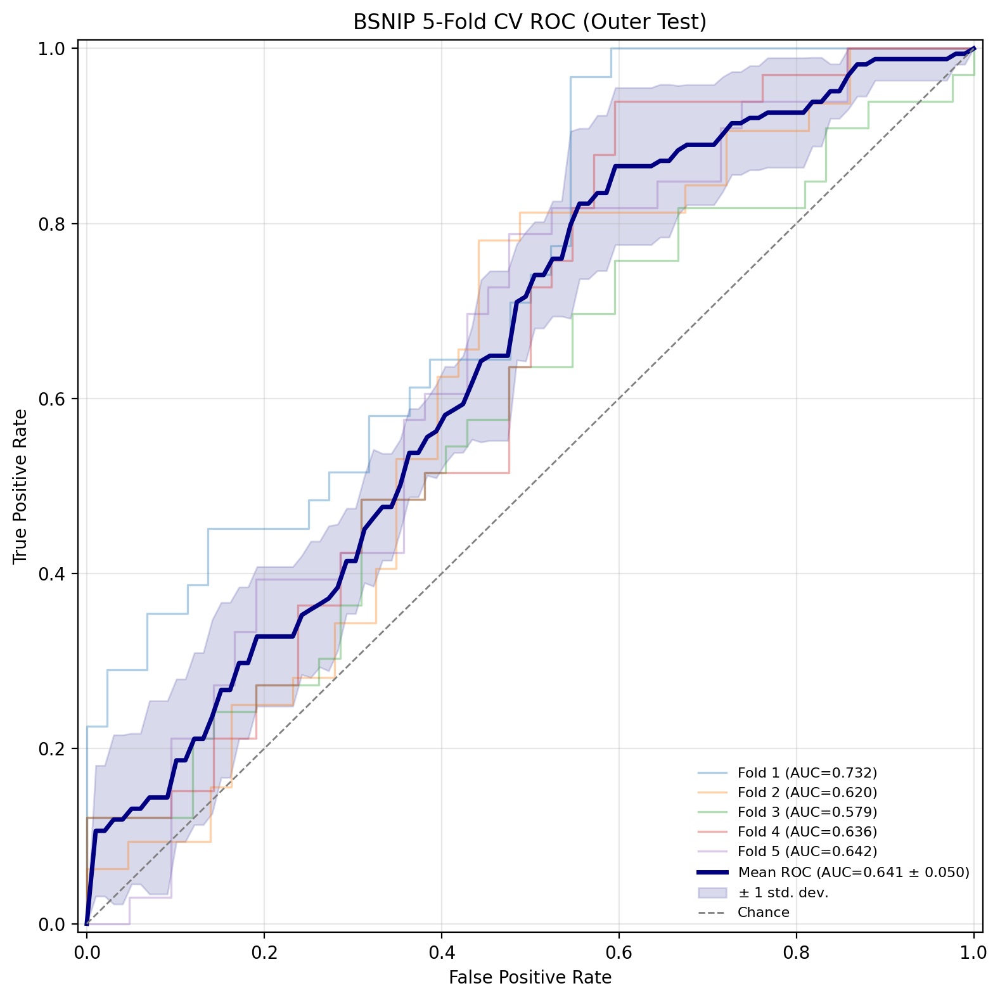

# B-SNIP 3D MRI Classification: 5-Fold Cross-Validation Benchmark

Comprehensive Out-of-Fold (OOF) evaluation of the 3D CNN pipeline with Global Average Pooling (GAP) on the complete B-SNIP cohort ($N = 375$ subjects).

---

## 1. Technical Framework & Leak-Free Cross-Validation

### Cohort & Stratification Scheme
* **Dataset Scope:** 375 total volumetric T1w MRI scans ($213$ Healthy Controls, $162$ Schizophrenia probands).
* **Multi-Center Stratification:** Folds were constructed via `StratifiedKFold(n_splits=5, shuffle=True, random_state=42)` on a joint composite key `label + "_" + site` across 5 collection sites (Chicago: 95, Georgia: 91, Dallas: 88, Boston: 80, Hartford: 21) to eliminate multi-site sequence distribution biases.
* **Leakage-Free Tri-Split Hierarchy:**
  * **Train ($n=240$):** Real-time 3D data augmentation (shifts $\pm 2$ voxels, flips $p=0.5$, Gaussian noise $\sigma=0.02$).
  * **Inner-Validation ($n=60$):** Strictly deterministic. Used solely for model checkpointing (peak validation AUC) and decision threshold grid search ($p^* \in [0.10, 0.90]$, step $0.01$).
  * **Outer-Test ($n=75$):** Completely held out until final inference.

  

---

## 2. Quantitative Results (Out-of-Fold Aggregation)

### Overall Benchmark Metrics ($Mean \pm Std$)

* **Discriminative Capacity (AUC-ROC):** **$0.6417 \pm 0.0500$**
* **Balanced Accuracy (Tuned $p^*$):** **$57.76 \pm 3.40\%$** (vs $53.31 \pm 4.58\%$ at default $p=0.50$)
* **Schizophrenia (SZ) Recall (Sensitivity):** **$73.35 \pm 35.79\%$**
* **Healthy Controls (HC) Precision:** **$78.40 \pm 14.63\%$**

### Per-Fold Breakdown (Outer-Test Split)

| Fold | Test Support (HC / SZ) | Test AUC | Balanced Acc ($p=0.50$) | Balanced Acc (Tuned $p^*$) | Optimal $p^*$ | SZ Recall (Tuned) | HC Recall (Tuned) |
| :--- | :--- | :--- | :--- | :--- | :--- | :--- | :--- |
| **Fold 1** | 44 / 31 | **0.7317** | 61.36% | **61.36%** | $0.50$ | 100.0% | 22.7% |
| **Fold 2** | 43 / 32 | **0.6199** | 49.67% | **51.56%** | $0.51$ | 3.1% | 100.0% |
| **Fold 3** | 42 / 33 | **0.5794** | 50.00% | **57.58%** | $0.47$ | 81.8% | 33.3% |
| **Fold 4** | 42 / 33 | **0.6356** | 55.52% | **58.01%** | $0.43$ | 97.0% | 19.0% |
| **Fold 5** | 42 / 33 | **0.6421** | 50.00% | **60.28%** | $0.70$ | 84.8% | 35.7% |
| **OOF Mean $\pm$ Std** | 42.6 / 32.4 | **$0.6417 \pm 0.05$** | **$53.31 \pm 4.58\%$** | **$57.76 \pm 3.40\%$** | — | **$73.35 \pm 35.79\%$** | **$42.16 \pm 29.59\%$** |

---

## 3. Clinical & Biological Interpretation (B-SNIP Literature)

* **Macroscopic Predictability Ceilings:** The empirical $58\text{--}64\%$ structural ceiling aligns with the transdiagnostic findings of the B-SNIP consortium (Clementz et al., 2022; Parker et al., 2025).
* **Biotype Heterogeneity:** DSM Schizophrenia comprises three distinct biological subgroups. The 3D CNN successfully identifies individuals with prominent ventriculomegaly and cortical gray matter reduction (Biotypes 1 and 2), but predictably fails on Biotype 3 cases whose structural neuroanatomy remains morphometrically indistinguishable from healthy controls on standard T1-weighted MRI.