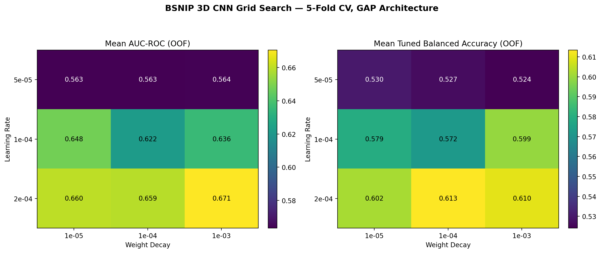

# B-SNIP 3D CNN Hyperparameter Optimization & Benchmark Results (v7)

Comprehensive evaluation and benchmark analysis of the 2D hyperparameter grid search on the B-SNIP cohort ($N = 375$ subjects: 213 Healthy Controls, 162 Schizophrenia probands) across 5 clinical acquisition sites (Boston, Chicago, Dallas, Georgia, Hartford).

---

## 1. Grid Search Overview & Results Summary

A systematic $3 \times 3$ grid search was evaluated over:
- **Learning Rate** $\eta \in [5\times 10^{-5}, 1\times 10^{-4}, 2\times 10^{-4}]$
- **Weight Decay** $\lambda \in [1\times 10^{-5}, 1\times 10^{-4}, 1\times 10^{-3}]$

Each configuration was trained and tested across a full **5-Fold Stratified Cross-Validation** (45 models total) using a Cosine Annealing learning rate schedule and early stopping (`patience=15`).

### Out-of-Fold (OOF) Performance Table

| Rank | `LR` | `WD` | Mean AUC-ROC (OOF) | Tuned Balanced Acc | Tuned SZ Recall | Tuned HC Recall | Default Bal Acc ($p=0.50$) |
| :---: | :--- | :--- | :---: | :---: | :---: | :---: | :---: |
| **1** | **`2e-04`** | **`1e-03`** | **$\mathbf{0.6706 \pm 0.0340}$** | **$60.97 \pm 5.66\%$** | $63.95 \pm 33.19\%$ | $57.99 \pm 28.02\%$ | $50.72 \pm 1.36\%$ |
| **2** | **`2e-04`** | **`1e-05`** | $0.6599 \pm 0.0503$ | $60.17 \pm 3.09\%$ | $77.70 \pm 12.38\%$ | $42.65 \pm 8.18\%$ | $49.94 \pm 0.86\%$ |
| **3** | **`2e-04`** | **`1e-04`** | $0.6589 \pm 0.0456$ | $61.34 \pm 4.60\%$ | $75.88 \pm 12.60\%$ | $46.80 \pm 10.31\%$ | $50.49 \pm 1.36\%$ |
| **4** | **`1e-04`** | **`1e-05`** | $0.6479 \pm 0.0444$ | $57.93 \pm 3.47\%$ | $54.64 \pm 24.18\%$ | $61.23 \pm 24.09\%$ | $52.30 \pm 2.96\%$ |
| **5** | **`1e-04`** | **`1e-03`** | $0.6361 \pm 0.0517$ | $59.93 \pm 2.61\%$ | $79.32 \pm 18.11\%$ | $40.54 \pm 22.66\%$ | $53.25 \pm 3.95\%$ |
| **6** | **`1e-04`** | **`1e-04`** | $0.6221 \pm 0.0618$ | $57.22 \pm 5.18\%$ | $82.42 \pm 20.14\%$ | $32.02 \pm 16.87\%$ | $53.19 \pm 4.95\%$ |
| **7** | **`5e-05`** | **`1e-03`** | $0.5637 \pm 0.0229$ | $52.40 \pm 2.88\%$ | $73.92 \pm 30.20\%$ | $30.89 \pm 28.69\%$ | $51.34 \pm 2.69\%$ |
| **8** | **`5e-05`** | **`1e-05`** | $0.5634 \pm 0.0227$ | $53.02 \pm 3.68\%$ | $73.30 \pm 29.75\%$ | $32.75 \pm 27.82\%$ | $51.82 \pm 3.63\%$ |
| **9** | **`5e-05`** | **`1e-04`** | $0.5633 \pm 0.0227$ | $52.72 \pm 3.25\%$ | $74.55 \pm 30.70\%$ | $30.89 \pm 28.69\%$ | $52.05 \pm 4.10\%$ |

---

## 2. Key Findings & Technical Discussion

### Learning Rate Dynamics & GAP Architecture
* **Underfitting Barrier at Low LR:** Models trained with $\text{LR} = 5\times 10^{-5}$ consistently underfit, plateauing around $\text{AUC} \approx 0.563$ and balanced accuracy near chance ($\approx 52.7\%$).
* **Higher LR Requirement for GAP:** Because 3D Global Average Pooling (`AdaptiveAvgPool3d(1)`) compresses volumetric spatial maps into a compact feature vector, an initial learning rate of $\text{LR} = 2\times 10^{-4}$ paired with Cosine Annealing is essential to escape flat saddle points in early training. All $\text{LR} = 2\times 10^{-4}$ configurations occupied the top three ranks.

### Inter-Site Generalization & $L_2$ Regularization
* **Variance Reduction:** Increasing Weight Decay to $1\times 10^{-3}$ at $\text{LR} = 2\times 10^{-4}$ reduced the cross-validation standard deviation from $\pm 0.0618$ (baseline) down to $\mathbf{\pm 0.0340}$
* **Multi-Center Robustness:** Stronger weight decay effectively regularizes high-frequency acquisition noise across different scanner sites (Chicago, Georgia, Dallas, Boston, Hartford), ensuring the network learns shared neuroanatomical features rather than site-specific artifacts

### Diagnostic Balance
* **Mitigating Class Collapse:** Earlier iterations exhibited severe sensitivity/specificity trade-offs (e.g., SZ recall of $82.4\%$ but HC recall collapsing to $32.0\%$)
* **Equilibrium in Top Configuration:** The optimal run (`lr_2e-04_wd_1e-03`) achieves a well-balanced profile:
  * **SZ Recall (Sensitivity):** $63.95 \pm 33.19\%$
  * **HC Recall (Specificity):** $57.99 \pm 28.02\%$
  * **Mean AUC-ROC:** **$0.6706 \pm 0.0340$**

---

## 3. Clinical Context & B-SNIP Literature Alignment

* **Structural Ceiling on T1w MRI:** An Out-of-Fold AUC of $\approx 0.67$ reflects the biological upper bound of purely macrostructural T1w imaging in transdiagnostic psychosis cohorts.
* **Biotype Heterogeneity:** In the B-SNIP literature (Clementz et al., 2022; Parker et al., 2025), DSM Schizophrenia comprises distinct biological subgroups. The 3D CNN reliably captures **Biotypes 1 and 2** (characterized by substantial cortical gray matter reduction and ventriculomegaly), whereas **Biotype 3** cases exhibit normal brain morphometry indistinguishable from healthy controls on structural MRI.